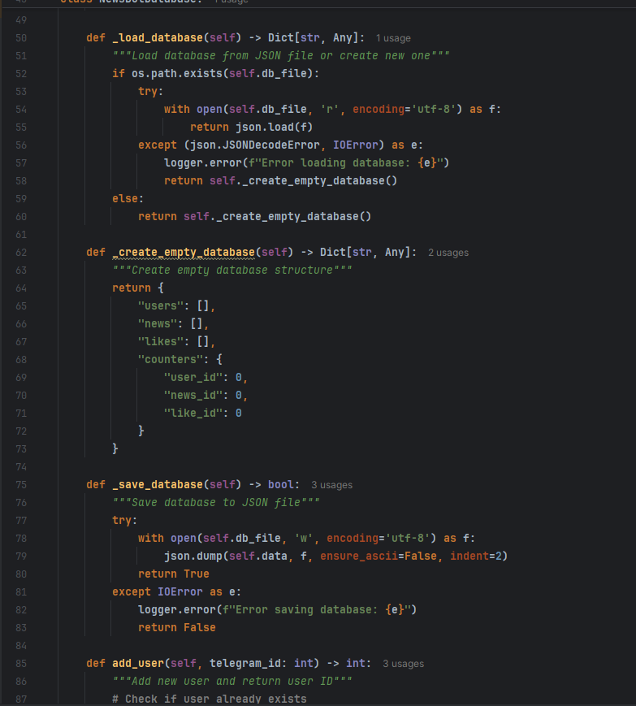

# Отчет по Лабораторной 1, 2 и 3

University: [ITMO University](https://itmo.ru/ru/)\
Faculty: FTMI\
Course: [Vibe Coding: AI-боты для бизнеса](https://github.com/itmo-ict-faculty/vibe-coding-for-business)\
Year: 2025/2026\
Group: U4225\
Author: Laptev Anatoly Aleksandrovich\
Lab: Lab1, Lab2, Lab3\
Date of create: 26.10.2025\
Date of finished: 27.10.2025

1. Выбор задачи\
Я выбрал вариант №4\

2. Создание пустого Бота\

3. Составление промпта для LLM\
Я выбрал для работы Cursor и дал ему следующую задачу:\
```
Создай Telegram-бота на Python с использованием библиотеки python-telegram-bot.

Функционал бота:
Хранимые сущности:
Требуется при инициализации Бота создать БД в виде json файла, в которой в будущем нужно будет хранить следующие данные:
1. Пользователь — поля: ИД(по сиквенсу), телеграм ИД
2. Новость — поля: ИД(по сиквенсу), время добавления, содержимое новости, ключевые слова, автор(ИД Пользователя)
3. Лайк — поля: ИД(по сиквенсу), ИД пользователя, ИД новости
Бот должен поддерживать основные команды:
1. Добавить новость ( команда /add_news)
В этом запросе Бот должен принимать от пользователя новость и набор ключевых слов, после чего добавлять в БД Пользователя если его еще нет, добавлять в БД Новость
2. Действие по расписанию, каждый день в 7:30 по Московскому времени Бот должен присылать все новости, добавленные за последние сутки, вместе с новостями нужно присылать их идентификаторы
3. Понравилась новость (команда /like_news)
В этом запросе Бот должен принимать от пользователя Идентификаторы понравившихся новостей, после чего создавать в БД сущности Лайк
4. Выдавать пользователю новости по ключевым словам (команда /get_news)
В этом запросе Бот должен принимать от пользователя набор ключевых слов и выдавать список новостей в которых эти ключевые слова есть

Требования:
- Бот должен быть простым и понятным
- Код должен быть хорошо прокомментирован
- Использовать файл для хранения данных (JSON)
- Добавить обработку ошибок

Создай:

1. Файл bot.py с кодом бота
2. Файл requirements.txt с зависимостями
3. Файл README.md с инструкцией по запуску
4. Файл .env.example для примера конфигурации
```

Через Яндекс.Переводчик перевел задание и отправил в LLM

```
Create a Telegram bot in Python using the python-telegram-bot library.

Bot functionality:
Stored entities:
When initializing the Bot, it is required to create a database in the form of a json file, in which the following data will need to be stored in the future:
1. User — fields: ID(by sequence), telegram ID
2. News — fields: ID(by sequence), time of addition, news content, keywords, author(User ID)
3. Like fields: ID(by sequence), User ID, News ID
The bot must support basic commands:
1. Add a news item (command /add_news)
In this request, the Bot must accept news and a set of keywords from the user, and then add the News to the User's database if it is not already there.
2. The action is scheduled, every day at 7:30 Moscow time, the bot must send all the news added over the past day, along with the news you need to send their ids
3. Liked the news (team /like_news)
In this request, the Bot must accept the IDs of the news it likes from the user, and then create a Like in the database.
4. Give the user news by keywords (command /get_news)
In this request, the Bot must accept a set of keywords from the user and provide a list of news items that contain these keywords.

Requirements:
- The bot should be simple and understandable
- The code should be well commented.
- Use a file to store data (JSON)
- Add error handling

Create:

1. File bot.py with the bot code
2. The file requirements.txt with dependencies
3. The file README.md with launch instructions
4. The .env.example file for an example configuration
```

4. Бот сразу был создан с Базой Данных и с возможностью в нее записывать и вычитывать
5. Поэтому для соблюдения формальностей для лабораторной 2 был выбран вариант 3\

6. Вот часть отвечающая за создание БД со схемой 3ей Нормальной Формы:\

7. Созданный LLM Бот конечно же не запустился с 1 раза и выдавал ошибку
```
__main__ - ERROR - Failed to start bot: 'Updater' object has no attribute '_Updater__polling_cleanup_cb' and no __dict__ for setting new attributes
```
Эта ошибка возникает из-за того что написанный код соответствует старым версия библиотек, \
но использует новые функции

8. Составляем запрос в Cursor для исправления кода и после нескольких итерация это удается\


9. Для Лабораторной 3 я выбрал вариант 2 - Облачный хостинг, а именно Railway\

10. Как итог 3х Лабораторных мы получаем рабочий вариант Бота который работает 24/7 и соответсвует нашему ТЗ\
Адрес ТГ Бота: @itmoftmi_laa_bot\
Скрины работы: \


Видео работы бота: https://disk.yandex.ru/i/NKxacksroDKoNQ